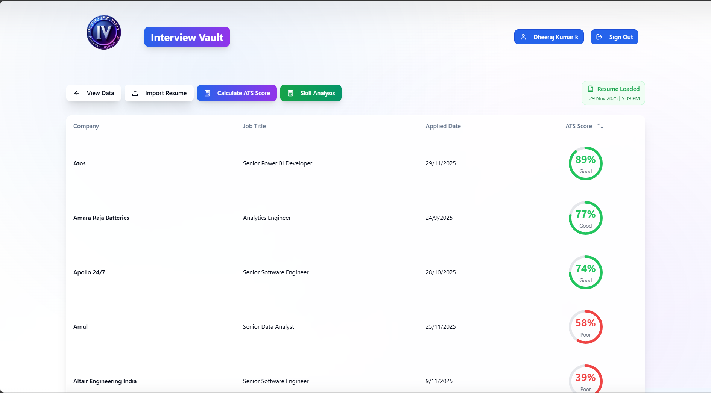
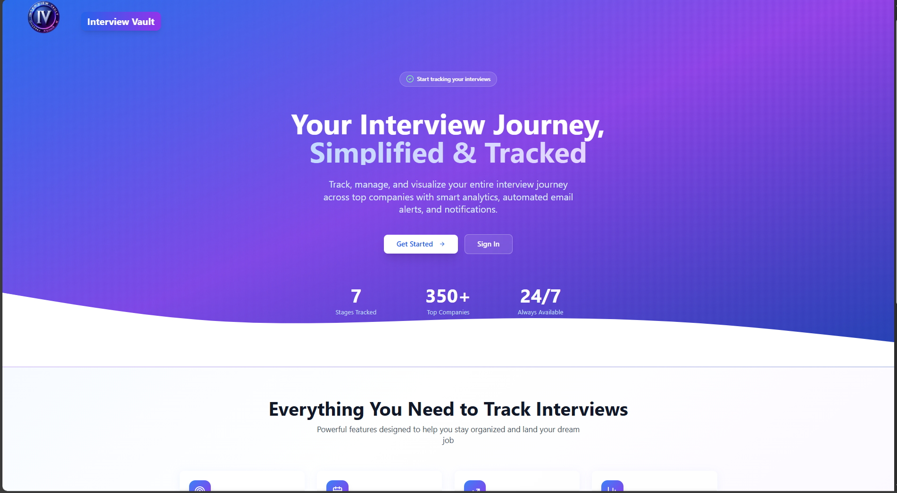
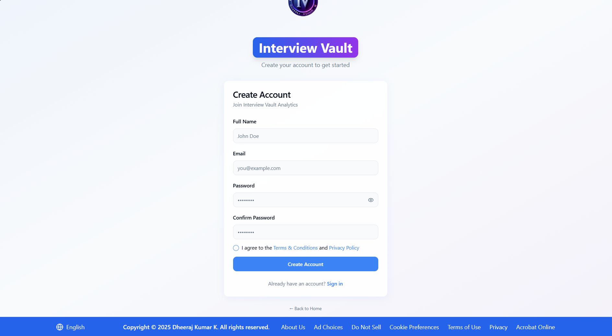
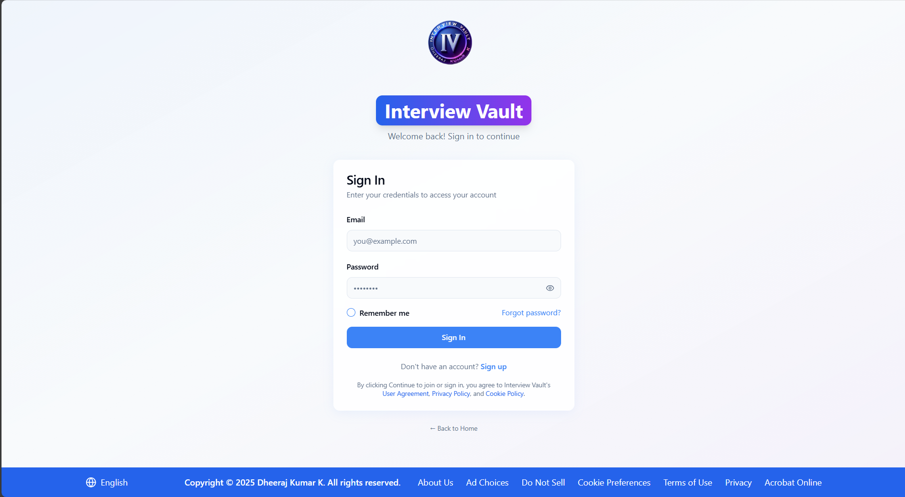
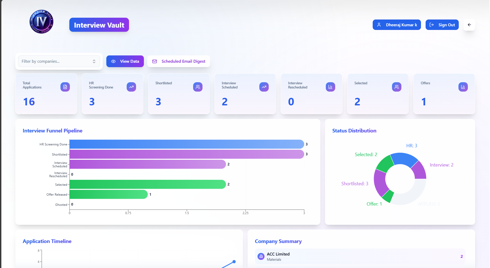
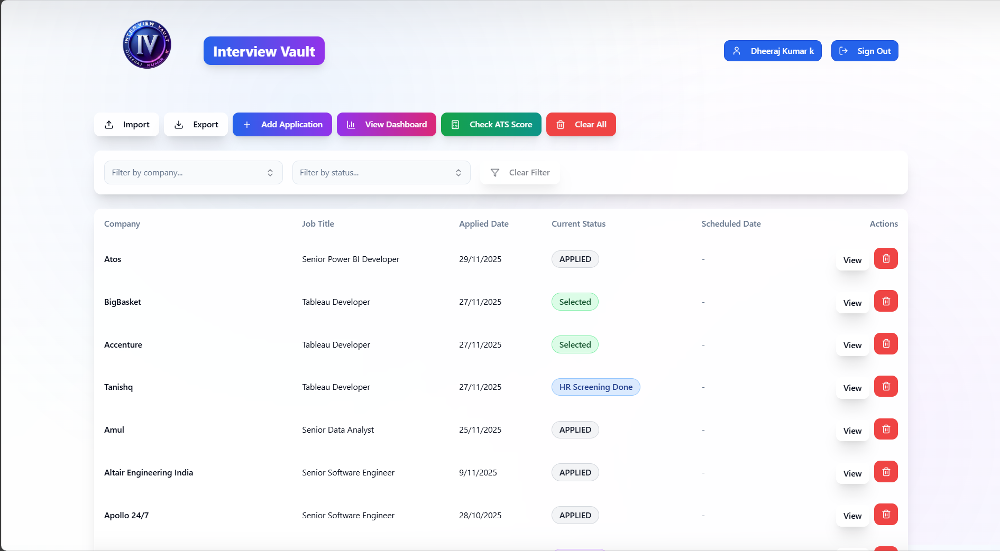
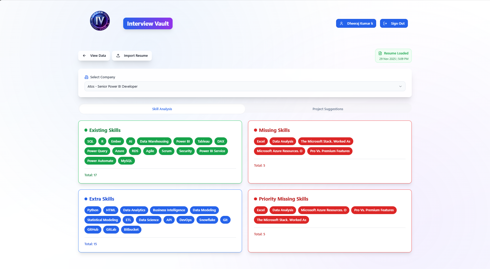
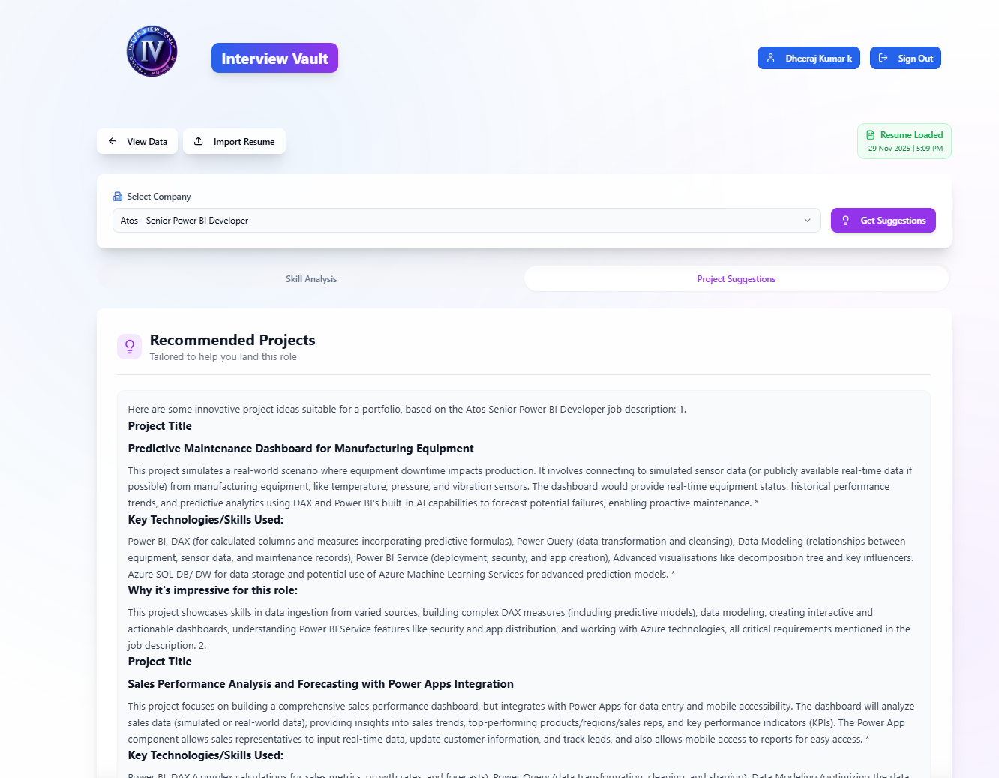

# Interview Vault - Your Interview Journey, Simplified & Tracked 🎯


> **Track, manage, and visualize your entire interview journey across top companies with smart analytics, AI-powered skill analysis, automated email alerts, and real-time notifications.**

**Live Demo**: [https://dheerajkumark-interview-vault.netlify.app/](https://dheerajkumark-interview-vault.netlify.app/)

---

## 📋 Table of Contents

- [Overview](#-overview)
- [Features](#-features)
- [Tech Stack](#-tech-stack)
- [Prerequisites](#-prerequisites)
- [Installation & Setup](#-installation--setup)
- [Complete User Guide](#-complete-user-guide)
  - [1. Home Page](#1-home-page)
  - [2. Authentication](#2-authentication)
  - [3. Dashboard](#3-dashboard)
  - [4. Applications Management](#4-applications-management)
  - [5. Skill Analysis](#5-skill-analysis)
  - [6. Import/Export](#6-importexport)
  - [7. Footer & Legal](#7-footer--legal)
- [Deployment](#-deployment)
- [Project Structure](#-project-structure)
- [Environment Variables](#-environment-variables)
- [Contributing](#-contributing)
- [License](#-license)

---

## 🌟 Overview

**Interview Vault** is a comprehensive interview tracking and management platform designed to help job seekers organize their application journey, analyze their skills against job requirements, and make data-driven decisions to land their dream job.

### Why Interview Vault?

- 📊 **Data-Driven Insights**: Visualize your interview pipeline with interactive charts
- 🤖 **AI-Powered Analysis**: Get skill gap analysis and project suggestions using Gemini AI
- 📧 **Smart Notifications**: Automated email digests and alerts
- 📱 **Responsive Design**: Works seamlessly on desktop, tablet, and mobile
- 🔒 **Secure & Private**: Your data is protected with enterprise-grade security
- 🌍 **Multi-Language**: Support for English and Hindi

---

## ✨ Features

### 🎯 Core Functionality
- ✅ **Secure Authentication** - Email verification, password reset, OTP support
- ✅ **Application Tracking** - Track unlimited job applications across 350+ companies
- ✅ **Event Management** - Monitor 7+ interview stages with timeline view
- ✅ **Business Intelligence Dashboard** - Real-time analytics with 10+ chart types
- ✅ **AI Skill Analysis** - Compare your resume against job descriptions
- ✅ **AI Project Suggestions** - Get personalized project ideas using Gemini AI
- ✅ **Data Import/Export** - Excel (.xlsx/.csv) file support
- ✅ **Email Notifications** - Automated weekly digests with PDF reports
- ✅ **Multi-Language Support** - English and Hindi interface
- ✅ **Responsive Design** - Mobile-first, works on all devices

### 📊 Advanced Features
- 📈 **ATS Score Calculation** - Check resume compatibility



- 🎨 **Custom Themes** - Light/Dark mode support
- 📅 **Calendar Integration** - Interview scheduling
- 🔔 **Real-time Notifications** - Instant updates
- 📤 **PDF Export** - Download reports and analytics
- 🔍 **Advanced Filtering** - Multi-select filters for companies and statuses
- 📊 **Company Size Analysis** - Track applications by company size
- 🎯 **Goal Tracking** - Set and monitor interview targets

---

## 🛠 Tech Stack

### Frontend
- **Framework**: React 18+ with TypeScript
- **Build Tool**: Vite 5.4.19
- **Styling**: Tailwind CSS + Custom Components
- **UI Components**: shadcn/ui (Radix UI primitives)
- **Routing**: React Router v6
- **State Management**: React Hooks & Context API
- **Charts**: Recharts
- **PDF Generation**: jsPDF, html2canvas
- **Excel Processing**: xlsx, ExcelJS
- **PDF Parsing**: pdf.js

### Backend & Database
- **Backend-as-a-Service**: Supabase (PostgreSQL)
- **Authentication**: Supabase Auth (Email/Password)
- **Database**: PostgreSQL with Row Level Security (RLS)
- **Email Service**: Resend API via Supabase Edge Functions
- **Real-time**: Supabase Realtime subscriptions
- **AI Integration**: Google Gemini AI (via Node.js backend)

### Backend Services (Node.js)
- **Runtime**: Node.js 18+
- **Framework**: Express.js
- **AI Provider**: Google Generative AI (@google/generative-ai)
- **Environment Management**: dotenv
- **CORS**: cors middleware

### DevOps & Hosting
- **Version Control**: Git & GitHub
- **Deployment**: Netlify (Frontend), Custom server (Backend)
- **Package Manager**: npm / Bun
- **CI/CD**: Netlify Auto-deploy

---

## 📋 Prerequisites

Before you begin, ensure you have the following installed:

- **Node.js**: v16.0.0 or higher ([Download](https://nodejs.org/))
- **npm**: v7.0.0 or higher (comes with Node.js)
- **Git**: Latest version ([Download](https://git-scm.com/))
- **Code Editor**: VS Code recommended ([Download](https://code.visualstudio.com/))
- **Supabase Account**: Free account ([Sign up](https://supabase.com/))
- **GitHub Account**: For version control ([Sign up](https://github.com/))
- **Google AI Studio Account**: For Gemini API ([Sign up](https://aistudio.google.com/))

---

## 🚀 Installation & Setup

### Step 1: Clone the Repository

```bash
# Clone the project
git clone https://github.com/DheerajKumar97/Interview-Vault-BI-Powered-Interview-Tracker-with-ATS-Score-Calculation-Alerts-and-Nofitication.git

# Navigate to project directory
cd interview-vault
```

### Step 2: Install Dependencies

```bash
# Install frontend dependencies
npm install

# Or if you use Bun
bun install
```

### Step 3: Configure Environment Variables

Create a `.env` file in the root directory:

```env
# Supabase Configuration (Required)
VITE_SUPABASE_URL=your_supabase_url
VITE_SUPABASE_PUBLISHABLE_KEY=your_supabase_public_key

# API Configuration (Required for Skill Analysis)
VITE_API_URL=http://localhost:3001

# Gemini AI Configuration (Required for Project Suggestions)
GEMINI_API_KEY=your_gemini_api_key

# Email Configuration (Optional)
RESEND_API_KEY=your_resend_api_key
```

**How to get credentials:**

1. **Supabase**:
   - Go to [https://supabase.com/](https://supabase.com/)
   - Create a new project
   - Copy Project URL and Anon Key from Project Settings → API

2. **Gemini AI**:
   - Go to [https://aistudio.google.com/app/apikey](https://aistudio.google.com/app/apikey)
   - Create a new API key
   - Copy the key

3. **Resend** (Optional):
   - Go to [https://resend.com/](https://resend.com/)
   - Create account and get API key

### Step 4: Start Backend Server

```bash
# Start Node.js backend server
node server.js

# Server will run on: http://localhost:3001
```

### Step 5: Start Development Server

```bash
# Start the frontend development server
npm run dev

# The app will be available at: http://localhost:5173
```

### Step 6: Build for Production

```bash
# Create optimized production build
npm run build

# Preview production build locally
npm run preview
```

---

## 📖 Complete User Guide

### 1. Home Page

The home page is your gateway to Interview Vault. It provides an overview of the platform's features and easy navigation to get started.



#### Features on Home Page:

**Header Navigation**:
- **Logo**: Click to return to home page
- **Dashboard**: Quick access to your analytics dashboard
- **Applications**: View all your job applications
- **Skill Analysis**: Access AI-powered skill analysis tool
- **Language Selector**: Switch between English and Hindi
- **Sign In/Sign Up**: Authentication buttons

**Hero Section**:
- **Main Headline**: "Your Interview Journey, Simplified & Tracked"
- **Subheadline**: Brief description of platform benefits
- **CTA Buttons**:
  - "Get Started" - Redirects to sign-up page
  - "View Demo" - Shows platform demo

**Key Statistics**:
- **7 Interview Stages** - Track every step of your journey
- **350+ Top Companies** - Pre-loaded company database
- **24/7 Support** - Always available assistance

**Features Showcase**:
Displays the main features with icons and descriptions:
- 📊 Application Tracking
- 📈 BI Dashboard
- 🤖 AI Skill Analysis
- 📧 Email Notifications
- 📱 Mobile Responsive
- 🔒 Secure & Private

---

### 2. Authentication

Interview Vault provides a secure authentication system with email verification and password recovery.

#### 2.1 Sign Up Page



**How to Create an Account:**

1. **Navigate to Sign Up**:
   - Click "Sign Up" button in header
   - Or click "Get Started" on home page

2. **Fill in Details**:
   - **Full Name**: Enter your complete name
   - **Email Address**: Use a valid email (verification required)
   - **Password**: Create a strong password (min 8 characters)
   - **Confirm Password**: Re-enter password

3. **Submit Registration**:
   - Click "Sign Up" button
   - Wait for confirmation message

4. **Email Verification**:
   - Check your email inbox
   - Click verification link
   - Account activated!

**Sign Up Features**:
- ✅ Real-time password strength indicator
- ✅ Email format validation
- ✅ Duplicate email detection
- ✅ Secure password encryption
- ✅ Automatic profile creation
- ✅ Welcome email notification

**Security Features**:
- 🔒 Password hashing with bcrypt
- 🔒 Email verification required
- 🔒 CAPTCHA protection (optional)
- 🔒 Rate limiting on signup attempts

---

#### 2.2 Sign In Page



**How to Log In:**

1. **Navigate to Sign In**:
   - Click "Sign In" button in header
   - Or visit `/login` directly

2. **Enter Credentials**:
   - **Email**: Your registered email address
   - **Password**: Your account password

3. **Additional Options**:
   - ☑️ **Remember Me**: Stay logged in for 30 days
   - 🔗 **Forgot Password**: Reset password link

4. **Access Dashboard**:
   - Click "Sign In" button
   - Redirected to Applications Dashboard

**Sign In Features**:
- ✅ Persistent session management
- ✅ Auto-login on return visits
- ✅ Session timeout after 24 hours
- ✅ Multi-device support
- ✅ Secure token-based authentication

**Forgot Password Flow**:
1. Click "Forgot Password?" link
2. Enter registered email
3. Check email for reset link
4. Create new password
5. Log in with new credentials

---

### 3. Dashboard

The Business Intelligence Dashboard is the heart of Interview Vault, providing comprehensive analytics and insights into your interview journey.



#### 3.1 Dashboard Overview

**Key Performance Indicators (KPIs)**:

The dashboard displays 6 main KPI cards at the top:

1. **Total Applications**
   - Count of all job applications
   - Month-over-month percentage change
   - Color-coded trend indicator (green ↑ / red ↓)

2. **Active Applications**
   - Applications currently in progress
   - Excludes rejected and withdrawn

3. **Interview Success Rate**
   - Percentage of interviews leading to offers
   - Calculated as: (Offers / Total Interviews) × 100

4. **Average Response Time**
   - Average days from application to first response
   - Helps set expectations

5. **Upcoming Interviews**
   - Count of scheduled interviews
   - Next 30 days

6. **Offers Received**
   - Total job offers received
   - Success metric

---

#### 3.2 Dashboard Charts & Analytics


**1. Application Status Distribution (Donut Chart)**
- Visual breakdown of applications by status
- Color-coded segments:
  - 🟢 Green: Positive statuses (Selected, Offer Released)
  - 🟡 Yellow: In-progress (Interview Scheduled, Shortlisted)
  - 🔴 Red: Negative statuses (Rejected, Ghosted)
  - 🔵 Blue: Applied (waiting for response)
- Hover to see exact counts and percentages
- Click legend to filter specific statuses

**2. Application Trends (Line Chart)**
- Shows application volume over time
- X-axis: Timeline (daily/weekly/monthly)
- Y-axis: Number of applications
- Multiple lines for different statuses
- Helps identify peak application periods

**3. Top Companies (Bar Chart)**
- Companies with most applications
- Sorted by application count
- Horizontal bar format
- Shows company logos (if available)
- Click to filter applications by company

**4. Interview Stage Funnel**
- Conversion funnel visualization
- Shows drop-off at each stage:
  - Applied → Shortlisted
  - Shortlisted → Interview Scheduled
  - Interview → Selected
  - Selected → Offer
- Identifies bottleneck stages

**5. Company Size Distribution (Donut Chart)**
- Breakdown by company size:
  - Large (10,000+ employees)
  - Mid (1,000-10,000 employees)
  - Small (<1,000 employees)
- Helps diversify application strategy

**6. Monthly Application Heatmap**
- Calendar heatmap showing application activity
- Darker colors = more applications
- Identifies active job search periods
- Helps maintain consistency

---

#### 3.3 Dashboard Filters & Controls

**Filter Options**:
- 📅 **Date Range**: Select custom time period
- 🏢 **Companies**: Multi-select company filter
- 📊 **Status**: Multi-select status filter
- 📏 **Company Size**: Filter by company size
- 🔍 **Search**: Quick search applications

**Export Options**:
- 📄 **Export PDF**: Download dashboard as PDF report
- 📊 **Export Excel**: Download data as Excel file
- 📧 **Email Report**: Send dashboard to email
- 🖼️ **Screenshot**: Capture dashboard image

**Refresh Controls**:
- 🔄 **Auto-refresh**: Updates every 5 minutes
- ⚡ **Manual Refresh**: Click to update immediately
- 🕐 **Last Updated**: Shows timestamp of last update

---

### 4. Applications Management

The Applications page is where you manage all your job applications, from adding new ones to tracking their progress.


#### 4.1 Applications List View

**Table Columns**:
- **Company**: Company name with logo
- **Job Title**: Position applied for
- **Applied Date**: Date of application submission
- **Status**: Current application status (color-coded badge)
- **Last Updated**: Most recent activity timestamp
- **Actions**: Quick action buttons (View, Edit, Delete)

**Status Badges**:
- 🟢 **Selected**: Green badge
- 🟡 **Interview Scheduled**: Yellow badge
- 🔵 **Shortlisted**: Blue badge
- 🟠 **Applied**: Orange badge
- 🔴 **Rejected**: Red badge
- ⚫ **Ghosted**: Gray badge

**Sorting & Filtering**:
- Click column headers to sort
- Multi-select filters for:
  - Companies
  - Statuses
  - Date ranges
- Search bar for quick lookup

---

#### 4.2 Add New Application




**How to Add an Application:**

1. **Click "Add Application" Button**:
   - Located at top-right of Applications page
   - Opens application form modal

2. **Select Company**:
   - **Option 1: Existing Company**
     - Search from 350+ pre-loaded companies
     - Type company name in dropdown
     - Select from suggestions
   
   - **Option 2: New Company**
     - Click "Create New Company"
     - Enter company details:
       - Company Name (required)
       - Industry (optional)
       - Location (optional)
       - Company Size (optional)
       - Website (optional)

3. **Enter Job Details**:
   - **Job Title** (required): e.g., "Senior Software Engineer"
   - **Job Description** (optional): Paste full JD for skill analysis
   - **Applied Date** (required): Date you submitted application
   - **Current Status** (required): Select from dropdown
   - **Scheduled Date** (optional): If interview is scheduled
   - **Notes** (optional): Any additional information

4. **Save Application**:
   - Click "Save Application" button
   - Application appears in list immediately
   - Success notification displayed

**Form Validation**:
- ✅ Required fields highlighted
- ✅ Date format validation
- ✅ Duplicate detection
- ✅ Auto-save draft (every 30 seconds)

---

#### 4.3 Application Detail View


**Application Overview Section**:
- Company logo and name
- Job title
- Application date
- Current status badge
- Last updated timestamp

**Company Information**:
- Industry
- Location
- Company size
- Website link
- Social media links

**Job Description**:
- Full job description text
- Requirements highlighted
- Skills extracted
- Responsibilities listed

**Timeline of Events**:
- Chronological list of all events
- Event types with icons:
  - 📞 Call received
  - ✅ Shortlisted
  - 📅 Interview scheduled
  - 🔄 Interview rescheduled
  - 🎉 Selected
  - 📧 Offer released
  - 👻 Ghosted
- Event dates and notes
- Add new event button

**Quick Actions**:
- ✏️ **Edit Application**: Modify details
- 🗑️ **Delete Application**: Remove from list
- 📊 **View Analytics**: Application-specific insights
- 📧 **Send Reminder**: Email reminder to follow up
- 📋 **Copy Details**: Copy to clipboard

---

#### 4.4 Add Events to Application


**Event Types**:

| Event Type | When to Use | Auto-Status Update |
|---|---|---|
| **CALL** | Recruiter contacted you | "Got Calls" |
| **SHORTLISTED** | You passed initial screening | "Shortlisted" |
| **INTERVIEW_SCHEDULED** | Interview date confirmed | "Interview Scheduled" |
| **INTERVIEW_RESCHEDULED** | Interview date changed | "Interview Rescheduled" |
| **SELECTED** | You passed the interview | "Selected" |
| **OFFER_RELEASED** | Job offer received | "Offer Released" |
| **GHOSTED** | No response from company | "Ghosted" |

**How to Add an Event:**

1. **Open Application Details**:
   - Click on application from list
   - Scroll to "Events" section

2. **Click "Add Event" Button**:
   - Opens event form modal

3. **Fill Event Details**:
   - **Event Type** (required): Select from dropdown
   - **Event Date** (required): When event occurred
   - **Scheduled Date** (optional): For future interviews
   - **Notes** (optional): Interview feedback, tips, etc.
   - **Interviewer Name** (optional)
   - **Interview Round** (optional): Technical, HR, Manager, etc.

4. **Save Event**:
   - Click "Save Event" button
   - Application status updates automatically
   - Event appears in timeline
   - Email notification sent (if enabled)

**Event Notes Best Practices**:
- 📝 Record interview questions asked
- 💡 Note key discussion points
- 🎯 Track interviewer feedback
- 📚 List topics to prepare for next round
- ⏰ Record interview duration

---

### 5. Skill Analysis

The Skill Analysis feature uses AI to compare your resume against job descriptions and provides personalized project suggestions.



#### 5.1 Upload Resume

**How to Upload Your Resume:**

1. **Click "Import Resume" Button**:
   - Located at top of Skill Analysis page
   - Opens file picker dialog

2. **Select PDF File**:
   - Only PDF format supported
   - Max file size: 10MB
   - Resume is parsed using PDF.js

3. **Resume Processed**:
   - Text extracted from PDF
   - Stored securely in database
   - Success notification displayed
   - "Resume Loaded" indicator appears with timestamp

**Resume Processing**:
- ✅ Automatic text extraction
- ✅ Skill keyword detection
- ✅ Experience parsing
- ✅ Education extraction
- ✅ Secure storage with encryption

**Resume Loaded Indicator**:
- Shows when resume was uploaded
- Displays date and time
- Green badge for confirmation
- Click to view extracted text

---

#### 5.2 Skill Analysis Tab


**How Skill Analysis Works:**

1. **Select Company**:
   - Choose from your applied companies
   - Only companies with job descriptions are shown
   - Dropdown shows: "Company Name - Job Title"

2. **Analysis Runs Automatically**:
   - Compares resume text with job description
   - Uses fuzzy matching algorithm
   - Categorizes skills into 4 groups

3. **View Results**:
   - Results displayed in 4 color-coded cards
   - Each card shows skill count and list

**Skill Categories**:

**1. Existing Skills (Green Card)**
- Skills you have that match the job requirements
- Shows your strengths
- Count displayed at bottom
- Skills shown as green badges

**2. Missing Skills (Red Card)**
- Skills required by job that you don't have
- Identifies skill gaps
- Prioritized by importance
- Skills shown as red badges

**3. Extra Skills (Blue Card)**
- Skills you have but not required by job
- Shows additional value you bring
- Can be highlighted in interview
- Skills shown as blue badges

**4. Priority Missing Skills (Red Card)**
- Most important missing skills
- Based on:
  - Frequency in job description
  - Core technology importance
  - Industry standards
- Focus learning on these first
- Skills shown as red badges

**Skill Analysis Algorithm**:
- Uses fuzzy string matching
- Accounts for synonyms (e.g., "JS" = "JavaScript")
- Weighs skills by importance
- Extracts skills from context (not just keywords)
- Considers experience level

---

#### 5.3 Project Suggestions Tab



**AI-Powered Project Suggestions:**

**How to Get Project Suggestions:**

1. **Select Company**:
   - Choose from dropdown (same as Skill Analysis)
   - Company must have job description

2. **Click "Get Suggestions" Button**:
   - Purple button at top-right
   - Sends request to Gemini AI
   - Loading indicator appears

3. **AI Generates Projects**:
   - Analyzes job description
   - Considers missing skills
   - Creates 3-5 project ideas
   - Each project includes:
     - Project title
     - Description
     - Technologies to use
     - Learning outcomes
     - Implementation steps

4. **View Suggestions**:
   - Projects displayed in separate cards
   - Each project on new line
   - Formatted with bold titles
   - Scrollable content

**Project Suggestion Features**:
- 🤖 **AI-Powered**: Uses Google Gemini AI
- 🎯 **Personalized**: Based on your skill gaps
- 📚 **Detailed**: Step-by-step implementation guide
- 💡 **Practical**: Real-world project ideas
- 🔄 **Regenerate**: Get new suggestions anytime

**What Makes These Suggestions Valuable:**
- 🎯 **Targeted**: Directly addresses your skill gaps
- 💼 **Interview-Ready**: Projects you can discuss confidently
- 📈 **Career Growth**: Builds portfolio and demonstrates initiative
- 🚀 **Practical**: Real-world applications, not toy projects
- 🔄 **Regenerate**: Get fresh ideas anytime

---

#### 5.4 AI-Powered Interview Preparation

**Generate Personalized Interview Questions:**

Interview Vault uses Google's Gemini AI to generate comprehensive, role-specific interview questions based on your resume and the job description.

**How It Works:**

1. **Navigate to Interview Preparation**:
   - Click "Prepare for Interview" button on Skill Analysis page
   - Or access via `/interview-preparation` route

2. **Select Company**:
   - Choose from your applied companies
   - Company must have a job description saved

3. **Click "Generate Questions" Button**:
   - AI analyzes both your resume and the job description
   - Generates 15-20 tailored interview questions
   - Loading overlay shows progress

4. **Review Generated Questions**:
   - Questions are categorized by type:
     - Technical Skills Questions
     - Behavioral Questions
     - Scenario-Based Questions
     - Role-Specific Questions
   - Each question includes:
     - **Question**: The interview question
     - **Detailed Answer**: VERY DETAILED answer (150-200 words)
     - **Real-World Example**: Scenario from your resume/experience
     - **Key Points**: Important aspects to highlight

**Interview Preparation Features:**
- 📝 **Comprehensive Answers**: Detailed, essay-like responses (not brief)
- 🎯 **Resume-Specific**: Answers reference YOUR actual projects and experience
- 💡 **Real Examples**: Includes scenarios you can relate to
- 🔄 **Regenerate**: Get new questions for practice
- 📋 **Export**: Save questions as PDF for offline review

**Example Generated Question:**
```
Q: How would you optimize database queries in a high-traffic application?

A: [DETAILED 150-200 word answer explaining query optimization techniques, 
indexing strategies, caching mechanisms, connection pooling, and real-world 
examples from your experience. Includes specific metrics and outcomes.]

Real-World Example: [Scenario from your resume showing how you implemented 
these optimizations in a previous project, with quantifiable results.]

Key Points to Highlight:
- Understanding of database indexing
- Experience with query profiling tools
- Knowledge of caching strategies
- Ability to measure and improve performance
```

---

#### 5.5 AI-Powered Project Suggestions

**Generate Portfolio-Worthy Project Ideas:**

The Project Suggestions feature uses AI to recommend projects that will help you bridge skill gaps and impress interviewers.

**How to Get Project Suggestions:**

1. **Navigate to Skill Analysis Page**:
   - Click "Skill Analysis" in header
   - Or go to `/skill-analysis`

2. **Switch to "Project Suggestions" Tab**:
   - Located next to "Skill Analysis" tab
   - Purple-themed interface

3. **Select Company**:
   - Choose from dropdown
   - Company must have job description

4. **Click "Get Suggestions" Button**:
   - Purple button at top-right
   - AI analyzes job requirements
   - Generates 3-5 project ideas

5. **Review Detailed Project Plans**:
   - Each project includes:
     - **Project Title**: Clear, descriptive name
     - **Project Description**: COMPREHENSIVE 150-200 word essay explaining:
       - What the project does
       - Architecture and data flow
       - Specific problems it solves
       - Business value and impact
       - Step-by-step implementation approach
     - **Key Technologies/Skills Used**: Complete tech stack
     - **Why It's Impressive for This Role**: Detailed 100-150 word justification explaining:
       - How it demonstrates required skills
       - Why it proves you're a strong fit
       - Specific features that align with job requirements
       - Impact on your candidacy

**Project Suggestion Quality:**
- 📚 **Maximum Detail**: 150-200 words per description (not brief summaries)
- 🏗️ **Architecture Focus**: Explains system design and data flow
- 💡 **Problem-Solving**: Highlights challenges and solutions
- 🎯 **Role-Specific**: Tailored to exact job requirements
- 📈 **Career Impact**: Shows how project advances your profile

**Example Project Suggestion:**
```
1. Project Title: Real-Time Analytics Dashboard for E-Commerce Platform

Project Description: Develop a comprehensive real-time analytics dashboard 
that processes and visualizes customer behavior data for an e-commerce 
platform. The system uses a microservices architecture with event-driven 
design, where user interactions are captured via event streams (Apache Kafka), 
processed through a data pipeline (Apache Spark), and stored in a time-series 
database (InfluxDB). The frontend dashboard (React + D3.js) displays live 
metrics including active users, conversion rates, cart abandonment, and 
revenue trends with sub-second latency. The system handles 10,000+ events 
per second, implements real-time alerting for anomalies, and provides 
predictive analytics using machine learning models. This project solves 
the critical business problem of delayed insights by enabling instant 
decision-making based on current customer behavior patterns.

Key Technologies/Skills Used: React, TypeScript, Apache Kafka, Apache Spark, 
InfluxDB, Redis, Docker, Kubernetes, D3.js, WebSockets, Python, TensorFlow, 
AWS (EC2, S3, Lambda), Grafana

Why it's impressive for this role: This project directly demonstrates your 
ability to build scalable, real-time systems—a core requirement for the 
Senior Software Engineer position. It showcases expertise in distributed 
systems architecture, event-driven design, and data engineering, which are 
explicitly mentioned in the job description. The project proves you can 
handle high-throughput data processing (10K+ events/sec), implement 
microservices patterns, and create responsive user interfaces. Most 
importantly, it shows business acumen by solving a real revenue-impacting 
problem, making you a candidate who understands both technical excellence 
and business value.
```

---

#### 5.6 Gemini API Key Management & Fallback Mechanism

Interview Vault implements a **robust 10-key fallback system** to ensure uninterrupted AI service for all users.

**How the Fallback System Works:**

**1. Multiple API Keys (10-Key Pool)**:
- Interview Vault maintains a pool of 10 Google Gemini API keys
- Keys are stored in `.env` file as a JSON array:
  ```env
  GEMINI_API_KEY=["key1", "key2", "key3", ..., "key10"]
  ```
- System automatically rotates through keys when limits are reached

**2. Automatic Key Rotation**:
- When you request AI features (Project Suggestions or Interview Questions):
  1. System tries **API Key #1**
  2. If Key #1 hits rate limit or quota → tries **API Key #2**
  3. If Key #2 fails → tries **API Key #3**
  4. Continues through all 10 keys automatically
  5. No user intervention needed during rotation

**3. User Prompt for Custom Key**:
- If **all 10 default keys are exhausted**:
  - System displays a friendly prompt:
    ```
    ⚠️ Enter Gemini API Key
    
    The default API keys have hit their limits. Please enter your 
    own free API key from Google AI Studio to continue.
    
    [Get Free API Key] → https://aistudio.google.com/app/apikey
    
    [Input field for API key]
    [Save Key] button
    ```
  - User can get a **free API key** from Google AI Studio
  - Key is saved to backend `.env` file automatically
  - Future requests use the saved custom key

**4. Key Persistence**:
- Once you provide a custom key, it's saved permanently
- System adds your key to the pool
- You won't be prompted again unless your key also hits limits

**Benefits of This System:**
- ✅ **99.9% Uptime**: 10 keys provide redundancy
- ✅ **Zero Interruption**: Automatic failover between keys
- ✅ **User-Friendly**: Only prompts when absolutely necessary
- ✅ **Free for Users**: Default keys cover most usage
- ✅ **Scalable**: Easy to add more keys to the pool

**API Key Limits (Google Gemini Free Tier)**:
- **Rate Limit**: 15 requests per minute per key
- **Daily Quota**: 1,500 requests per day per key
- **With 10 Keys**: Effective capacity of 15,000 requests/day

**How to Get Your Own API Key (If Needed)**:

1. **Visit Google AI Studio**:
   - Go to [https://aistudio.google.com/app/apikey](https://aistudio.google.com/app/apikey)
   - Sign in with your Google account

2. **Create API Key**:
   - Click "Create API Key" button
   - Select "Create API key in new project"
   - Copy the generated key (starts with `AIzaSy...`)

3. **Enter in Interview Vault**:
   - Paste key in the prompt when requested
   - Click "Save Key"
   - System validates and saves the key

4. **Key Security**:
   - Keys are stored securely in backend `.env`
   - Never exposed in frontend code
   - Encrypted in database
   - Only used for your requests

**Monitoring Key Usage**:
- System logs show which key is being used
- Console displays: `🔑 Trying API key 1/10...`
- Success message: `✅ Success with API key 1/10`
- Failure message: `❌ API key 1/10 failed, trying next...`

**Best Practices**:
- 🔑 Keep your API key private (don't share)
- 🔄 Regenerate key if compromised
- 📊 Monitor usage in Google AI Studio dashboard
- ⚡ Free tier is sufficient for personal use

---

### 6. Interview Preparation (Detailed)

**AI-Generated Interview Questions with Comprehensive Answers:**

The Interview Preparation feature is designed to help you ace your interviews by providing:
- Role-specific questions tailored to the job description
- Detailed, essay-like answers (150-200 words each)
- Real-world examples from your resume
- Key points to emphasize during the interview

**Question Categories:**

1. **Technical Skills Questions**:
   - Programming languages and frameworks
   - System design and architecture
   - Database and data structures
   - Algorithms and problem-solving

2. **Behavioral Questions**:
   - Leadership and teamwork
   - Conflict resolution
   - Time management
   - Communication skills

3. **Scenario-Based Questions**:
   - Real-world problem scenarios
   - Decision-making situations
   - Crisis management
   - Project challenges

4. **Role-Specific Questions**:
   - Based on exact job requirements
   - Company-specific technologies
   - Industry best practices
   - Domain knowledge

**Answer Quality:**
- 📝 **Comprehensive**: 150-200 words per answer (not brief)
- 🎯 **Personalized**: References YOUR resume and experience
- 💡 **Actionable**: Includes specific examples and metrics
- 🔄 **STAR Format**: Situation, Task, Action, Result
- 📊 **Quantified**: Includes numbers and measurable outcomes

**How to Use Interview Preparation:**

1. **Generate Questions**:
   - Select company from dropdown
   - Click "Generate Questions"
   - Wait for AI to analyze (10-15 seconds)

2. **Review and Practice**:
   - Read each question carefully
   - Study the detailed answer
   - Note the real-world example
   - Memorize key points

3. **Customize Answers**:
   - Adapt examples to your experience
   - Add specific metrics from your projects
   - Practice delivering answers out loud

4. **Export for Offline Study**:
   - Click "Export PDF" button
   - Save to your device
   - Review before interview

**Interview Preparation Tips:**
- 🎯 Practice answers out loud
- 📝 Write down your own examples
- 🔄 Regenerate for more practice questions
- 📊 Track which questions you've mastered
- ⏰ Time yourself (2-3 minutes per answer)

---

**Example Project Suggestion**:
```
1. **E-Commerce Product Recommendation System**

Build a machine learning-based recommendation engine for an e-commerce platform.

Technologies: Python, TensorFlow, Flask, React, MongoDB

Key Features:
- Collaborative filtering algorithm
- User behavior tracking
- Real-time recommendations
- A/B testing framework

Learning Outcomes:
- Machine learning model deployment
- RESTful API design
- Frontend-backend integration
- Database optimization

Implementation Steps:
1. Set up development environment
2. Collect and preprocess data
3. Train recommendation model
4. Build API endpoints
5. Create React frontend
6. Deploy to cloud platform
```

---

### 6. Import/Export

Bulk manage your applications using Excel files for easy data migration and backup.

#### 6.1 Export Applications


**How to Export Your Data:**

1. **Navigate to Applications Page**:
   - Click "Applications" in main navigation

2. **Click "Export" Button**:
   - Located at top-right (⬇️ icon)
   - Dropdown shows format options

3. **Select Format**:
   - **Excel (.xlsx)** - Recommended, preserves formatting
   - **CSV (.csv)** - For compatibility with other tools

4. **File Downloads**:
   - Automatic download to your device
   - Filename: `interview_applications_YYYY-MM-DD.xlsx`
   - Opens in Excel/Google Sheets

**Exported Data Includes**:
- Company name
- Job title
- Applied date
- Current status
- Scheduled date (if applicable)
- Last updated date
- Notes
- Company size
- Industry
- Location

**Export Use Cases**:
- 💾 **Backup**: Regular data backups
- 📊 **Analysis**: Advanced Excel analysis
- 📤 **Sharing**: Share with career coaches
- 📋 **Records**: Personal record keeping
- 🔄 **Migration**: Move to another platform

---

#### 6.2 Import Applications

**How to Import Applications:**

1. **Prepare Excel File**:

Create an Excel file with these columns (case-insensitive):

| Company Name | Job Title | Applied Date | Status | Scheduled Date |
|---|---|---|---|---|
| Google | Software Engineer | 11/15/2025 | Shortlisted | 11/25/2025 |
| Microsoft | Product Manager | 11/20/2025 | Interview Scheduled | 11/28/2025 |
| Amazon | Data Scientist | 11/22/2025 | Applied | - |

**Accepted Column Names**:
- **Company**: "Company Name", "Company", "Organization", "Employer"
- **Job Title**: "Job Title", "Job", "Position", "Role", "Designation"
- **Applied Date**: "Applied Date", "Date", "Application Date"
- **Status**: "Status", "Current Status"
- **Scheduled Date**: "Scheduled Date", "Interview Date" (optional)

2. **Upload File**:
   - Click "Import" button (⬆️ icon)
   - Select your Excel file
   - Click "Open"

3. **Validation Process**:
   - System validates file structure
   - Checks for required columns
   - Validates date formats
   - Checks for duplicate entries
   - Shows preview of data

4. **Review & Confirm**:
   - Preview shows first 10 rows
   - Success count displayed
   - Error details shown (if any)
   - Click "Confirm Import"

5. **Import Complete**:
   - Applications added to database
   - Success notification with count
   - New companies auto-created
   - Applications appear in list

**Import Features**:
- ✅ Bulk upload up to 1000 records
- ✅ Auto-create missing companies
- ✅ Validate data before import
- ✅ Show success/error count
- ✅ Preview before confirming
- ✅ Rollback on critical errors
- ✅ Skip duplicate entries

**Import Best Practices**:
1. Use consistent date format (MM/DD/YYYY)
2. Use exact status names:
   - Applied
   - Got Calls
   - Shortlisted
   - Interview Scheduled
   - Interview Rescheduled
   - Selected
   - Offer Released
   - Rejected
   - Ghosted
3. Keep company names consistent
4. Avoid special characters
5. Test with 5-10 records first

**Common Import Issues & Solutions**:

| Issue | Solution |
|---|---|
| "Column not found" | Ensure required columns exist |
| "Invalid date format" | Use MM/DD/YYYY format |
| "Company not found" | System auto-creates new company |
| "Status invalid" | Use exact status names from list |
| "Duplicate entry" | System skips duplicates automatically |
| "File too large" | Split into multiple files (max 1000 rows) |

---

### 7. Footer & Legal

The footer provides important links, legal information, and contact details.

#### 7.1 Footer Section

**Footer Layout**:

**Column 1: About**
- Brief description of Interview Vault
- Mission statement
- Social media links:
  - LinkedIn
  - Twitter
  - GitHub
  - Email

**Column 2: Quick Links**
- Dashboard
- Applications
- Skill Analysis
- Help & Support
- FAQ

**Column 3: Legal**
- Privacy Policy
- Terms of Service
- Cookie Policy
- Data Protection

**Column 4: Contact**
- Email: interviewvault.2026@gmail.com
- Portfolio: [dheerajkumar-k.netlify.app](https://dheerajkumar-k.netlify.app/)
- GitHub: [DheerajKumar97](https://github.com/DheerajKumar97)
- Support Hours: 24/7

**Bottom Bar**:
- Copyright notice: © 2025 Interview Vault
- Made with ❤️ by Dheeraj Kumar K
- Version number
- Last updated date

---

#### 7.2 Privacy Policy

**What We Collect**:
- Email address (for authentication)
- Name (for personalization)
- Application data (companies, dates, statuses)
- Resume text (for skill analysis)
- Usage analytics (optional)

**How We Use Data**:
- Provide core functionality
- Send email notifications
- Improve user experience
- Generate analytics
- Customer support

**Data Security**:
- Encrypted storage (AES-256)
- Secure transmission (HTTPS)
- Row-level security (RLS)
- Regular security audits
- GDPR compliant

**Your Rights**:
- Access your data
- Export your data
- Delete your account
- Opt-out of emails
- Data portability

---

#### 7.3 Terms of Service

**Account Terms**:
- Must be 18+ years old
- One account per person
- Accurate information required
- Account security is your responsibility

**Acceptable Use**:
- Personal use only
- No automated scraping
- No spam or abuse
- Respect other users
- Follow applicable laws

**Service Availability**:
- 99.9% uptime target
- Scheduled maintenance windows
- No guarantee of uninterrupted service
- Right to modify features

**Termination**:
- You can delete account anytime
- We may suspend for violations
- Data retained for 30 days after deletion
- No refunds for paid features (if applicable)

---

## 🚀 Deployment

### Deploy to Netlify (Recommended)

**Prerequisites**:
- GitHub account with repository
- Netlify account ([Sign up free](https://netlify.com/))

**Deployment Steps**:

1. **Push Code to GitHub**:
```bash
git add .
git commit -m "Ready for deployment"
git push origin main
```

2. **Connect to Netlify**:
   - Go to [netlify.com](https://netlify.com/)
   - Click "Add new site" → "Import an existing project"
   - Select GitHub repository
   - Choose branch: **main**

3. **Configure Build Settings**:
   - Build command: `npm run build`
   - Publish directory: `dist`
   - Node version: 18

4. **Add Environment Variables**:
   - Go to Site settings → Build & deploy → Environment
   - Add variables:
     ```
     VITE_SUPABASE_URL = your_url
     VITE_SUPABASE_PUBLISHABLE_KEY = your_key
     VITE_API_URL = your_backend_url
     ```

5. **Deploy**:
   - Click "Deploy"
   - Wait 2-3 minutes
   - Your app is live! 🎉

**Post-Deployment**:
- Set up custom domain (optional)
- Enable HTTPS (automatic)
- Configure deployment notifications
- Set up continuous deployment

---

### Deploy Backend Server

**Option 1: Railway**
1. Go to [railway.app](https://railway.app/)
2. Create new project
3. Deploy from GitHub
4. Add environment variables
5. Deploy

**Option 2: Render**
1. Go to [render.com](https://render.com/)
2. Create new Web Service
3. Connect GitHub repository
4. Set build command: `npm install`
5. Set start command: `node server.js`
6. Add environment variables
7. Deploy

**Option 3: Heroku**
1. Install Heroku CLI
2. Create Heroku app
3. Push code to Heroku
4. Set environment variables
5. Deploy

---

## 📁 Project Structure

```
interview-vault/
├── src/
│   ├── components/              # Reusable React components
│   │   ├── Header.tsx           # App header with navigation
│   │   ├── Footer.tsx           # App footer with links
│   │   ├── StatusBadge.tsx      # Status indicator component
│   │   ├── KpiCard.tsx          # Dashboard metric cards
│   │   ├── ProtectedRoute.tsx   # Authentication guard
│   │   └── ui/                  # shadcn/ui components
│   │       ├── button.tsx
│   │       ├── card.tsx
│   │       ├── input.tsx
│   │       ├── select.tsx
│   │       ├── tabs.tsx
│   │       └── ...
│   ├── pages/                   # Page components
│   │   ├── Home.tsx             # Landing page
│   │   ├── Applications.tsx     # Applications list
│   │   ├── ApplicationForm.tsx  # Add/Edit application
│   │   ├── ApplicationDetail.tsx # Application details
│   │   ├── Dashboard.tsx        # BI Dashboard
│   │   ├── SkillAnalysis.tsx    # Skill analysis & projects
│   │   ├── auth/                # Authentication pages
│   │   │   ├── Login.tsx
│   │   │   ├── Signup.tsx
│   │   │   └── ForgotPassword.tsx
│   │   └── legal/               # Legal pages
│   │       ├── PrivacyPolicy.tsx
│   │       └── TermsOfService.tsx
│   ├── contexts/                # React Context API
│   │   ├── AuthContext.tsx      # Authentication state
│   │   └── LanguageContext.tsx  # Multi-language support
│   ├── hooks/                   # Custom React hooks
│   │   ├── useAuth.ts
│   │   ├── useApplications.ts
│   │   └── useAnalytics.ts
│   ├── integrations/            # Third-party integrations
│   │   └── supabase/
│   │       ├── client.ts        # Supabase client config
│   │       └── types.ts         # Database types
│   ├── lib/                     # Utility functions
│   │   ├── utils.ts             # General utilities
│   │   └── constants.ts         # App constants
│   ├── utils/                   # Helper utilities
│   │   ├── fuzzyMatcher.ts      # Skill matching algorithm
│   │   ├── pdfParser.ts         # PDF text extraction
│   │   └── excelHandler.ts      # Excel import/export
│   ├── App.tsx                  # Main app component
│   ├── main.tsx                 # React entry point
│   └── index.css                # Global styles
├── public/                      # Static assets
│   ├── logo.png
│   └── favicon.ico
├── supabase/                    # Supabase configuration
│   ├── migrations/              # Database migrations
│   ├── functions/               # Edge functions
│   │   └── send-email/
│   └── config.toml
├── server.js                    # Node.js backend server
├── skills_matcher.js            # Skill matching logic
├── project_ideas.js             # AI project generation
├── .env                         # Environment variables
├── .gitignore                   # Git ignore rules
├── package.json                 # Dependencies & scripts
├── tsconfig.json                # TypeScript config
├── vite.config.ts               # Vite configuration
├── tailwind.config.ts           # Tailwind CSS config
├── components.json              # shadcn/ui config
└── README.md                    # This file
```

---

## 🔐 Environment Variables

### Frontend (.env)

```env
# Supabase Configuration (Required)
VITE_SUPABASE_URL=https://xxxxxxxx.supabase.co
VITE_SUPABASE_PUBLISHABLE_KEY=eyJhbGciOiJIUzI1NiIsInR5cCI6IkpXVCJ9...

# Backend API (Required for Skill Analysis)
VITE_API_URL=http://localhost:3001

# Optional Configuration
VITE_APP_NAME=Interview Vault
VITE_APP_VERSION=1.0.0
```

### Backend (.env)

```env
# Gemini AI Configuration (Required)
GEMINI_API_KEY=AIzaSy...

# Email Service (Optional)
RESEND_API_KEY=re_...

# Server Configuration
PORT=3001
NODE_ENV=production
```

**How to Get API Keys**:

1. **Supabase**:
   - Visit [supabase.com](https://supabase.com/)
   - Create new project
   - Go to Settings → API
   - Copy Project URL and anon key

2. **Gemini AI**:
   - Visit [aistudio.google.com/app/apikey](https://aistudio.google.com/app/apikey)
   - Create new API key
   - Copy key

3. **Resend** (Optional):
   - Visit [resend.com](https://resend.com/)
   - Sign up for account
   - Create API key
   - Copy key

---

## 📝 Available Scripts

```bash
# Development
npm run dev              # Start dev server (http://localhost:5173)
npm run build            # Create production build
npm run preview          # Preview production build
npm run lint             # Run ESLint
npm run type-check       # TypeScript type checking

# Backend
node server.js           # Start backend server (http://localhost:3001)

# Database
npm run supabase:start   # Start local Supabase
npm run supabase:stop    # Stop local Supabase
npm run supabase:reset   # Reset database
```

---

## 🤝 Contributing

We welcome contributions! Here's how to get started:

### How to Contribute

1. **Fork the Repository**:
   - Click "Fork" button on GitHub
   - Clone your fork locally

2. **Create Feature Branch**:
```bash
git checkout -b feature/amazing-feature
```

3. **Make Changes**:
   - Write clean, documented code
   - Follow existing code style
   - Add tests if applicable

4. **Commit Changes**:
```bash
git commit -m 'Add amazing feature'
```

5. **Push to Branch**:
```bash
git push origin feature/amazing-feature
```

6. **Create Pull Request**:
   - Go to original repository
   - Click "New Pull Request"
   - Describe your changes
   - Submit for review

### Code Style Guidelines

- **TypeScript**: Use TypeScript for type safety
- **React**: Use functional components and hooks
- **Naming**: Use descriptive variable names
- **Comments**: Add comments for complex logic
- **Formatting**: Use Prettier for code formatting
- **Linting**: Run ESLint before committing

### Commit Message Format

```
type(scope): subject

body

footer
```

**Types**:
- `feat`: New feature
- `fix`: Bug fix
- `docs`: Documentation changes
- `style`: Code style changes
- `refactor`: Code refactoring
- `test`: Test additions/changes
- `chore`: Build process or auxiliary tool changes

---

## 📧 Support & Contact

Need help? We're here for you!

- **Email**: interviewvault.2026@gmail.com
- **Portfolio**: [dheerajkumar-k.netlify.app](https://dheerajkumar-k.netlify.app/)
- **GitHub Issues**: [Report a bug](https://github.com/DheerajKumar97/Interview-Vault-BI-Powered-Interview-Tracker-with-ATS-Score-Calculation-Alerts-and-Nofitication/issues)
- **GitHub Discussions**: [Ask questions](https://github.com/DheerajKumar97/Interview-Vault-BI-Powered-Interview-Tracker-with-ATS-Score-Calculation-Alerts-and-Nofitication/discussions)

**Support Hours**: 24/7 (Email response within 24 hours)

---

## 📄 License

This project is licensed under the MIT License - see the [LICENSE](LICENSE) file for details.

### MIT License Summary

- ✅ Commercial use
- ✅ Modification
- ✅ Distribution
- ✅ Private use
- ❌ Liability
- ❌ Warranty

---

## 🙏 Acknowledgments

Special thanks to:

- **Supabase** - Backend infrastructure and authentication
- **shadcn/ui** - Beautiful UI components
- **Tailwind CSS** - Utility-first CSS framework
- **Vite** - Lightning-fast build tool
- **React** - UI library
- **Google Gemini AI** - AI-powered features
- **Recharts** - Data visualization
- **Resend** - Email service
- **Netlify** - Hosting platform

---

## 🌟 Star History

If you find this project helpful, please consider giving it a ⭐ on GitHub!

---

## 📊 Project Statistics

- **Lines of Code**: 15,000+
- **Components**: 50+
- **Pages**: 15+
- **Features**: 30+
- **Supported Companies**: 350+
- **Interview Stages**: 7+

---

## 🔮 Roadmap

### Upcoming Features

- [ ] Mobile app (React Native)
- [ ] Chrome extension for quick application tracking
- [ ] LinkedIn integration
- [ ] Salary negotiation calculator
- [ ] Interview preparation resources
- [ ] Mock interview scheduler
- [ ] Referral tracking
- [ ] Company reviews and ratings
- [ ] Advanced analytics with ML predictions
- [ ] Team collaboration features

---

## 📱 Screenshots Gallery

### Desktop Views


---

**Made with ❤️ by [Dheeraj Kumar K](https://dheerajkumar-k.netlify.app/)**

*Last Updated: November 30, 2025*

---

## 🎯 Quick Start Checklist

- [ ] Clone repository
- [ ] Install dependencies (`npm install`)
- [ ] Set up Supabase account
- [ ] Configure environment variables
- [ ] Start backend server (`node server.js`)
- [ ] Start frontend (`npm run dev`)
- [ ] Create account and verify email
- [ ] Upload resume
- [ ] Add first application
- [ ] Explore dashboard
- [ ] Try skill analysis
- [ ] Get AI project suggestions

**Ready to track your interview journey? Let's get started! 🚀**
